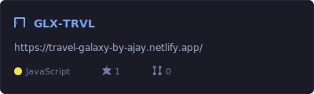
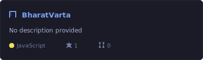
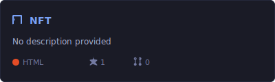
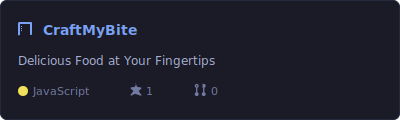
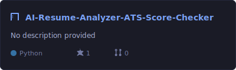
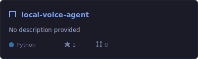
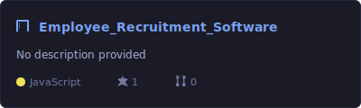

# Hi there, I'm Ajay Meru 👋

Full-Stack Developer & Automation Engineer specializing in building robust web applications, optimizing databases, and designing seamless API integrations.

---

### 🛠️ Core Stack & Tooling

- **Frontend:** React (Vite), Next.js, Tailwind CSS, HTML5/CSS3, JavaScript (ES6+)
- **Backend & Database:** Node.js, Express, MongoDB, RESTful APIs
- **Automation & DevOps:** n8n Workflow Automation, Webhooks, Playwright (Automation Testing), Git/GitHub

---

### 📊 GitHub Analytics 

Here is a live look at my GitHub activity and language distribution, generated automatically from all my repositories:

<!-- Dynamic GitHub Stats Cards -->

  
  

  

---

### ⭐ Starred Projects

Here is a look at the projects I've starred, showing live metrics directly from the repository:

<!-- STARRED-START -->

  
  

  
  

  
  

  

<!-- STARRED-END -->

---

### 🚀 Featured Focus Areas

#### 🌐 Full-Stack Applications
Building modern web architectures using the **MERN Stack** and **Next.js**. I focus on fast render times, clean routing structures, and intuitive user experiences.

#### ⚡ Automation & Workflow Integrations
Architecting custom backend triggers and automated pipelines using **n8n** and webhooks to link complex APIs, parse data structures, and handle seamless data syncing.

---

### ⚡ Recent Activity

Here is my latest activity across my repositories:

<!--START_SECTION:activity-->
<!--END_SECTION:activity-->

---

### 📫 Connect with Me

- 💼 **LinkedIn:** [linkedin.com/in/ajaymeru](https://linkedin.com) 
- 🛠️ **GitHub:** [@ajaymeru](https://github.com/ajaymeru)
